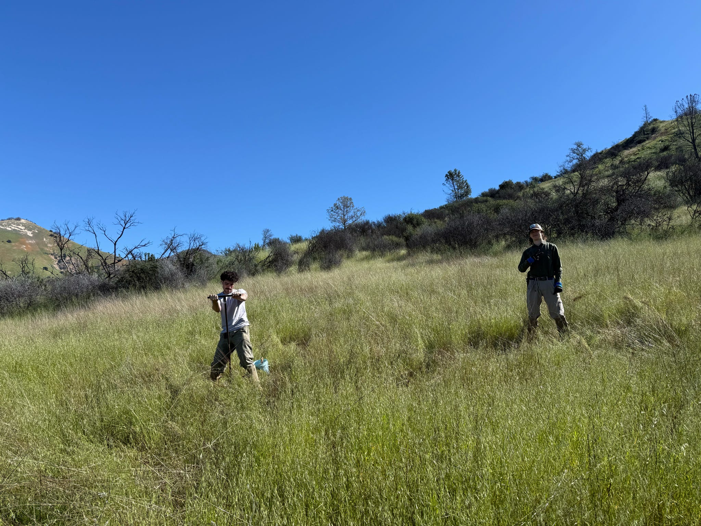
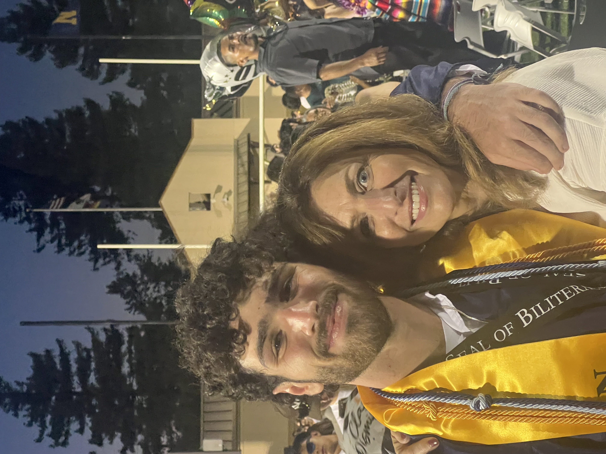
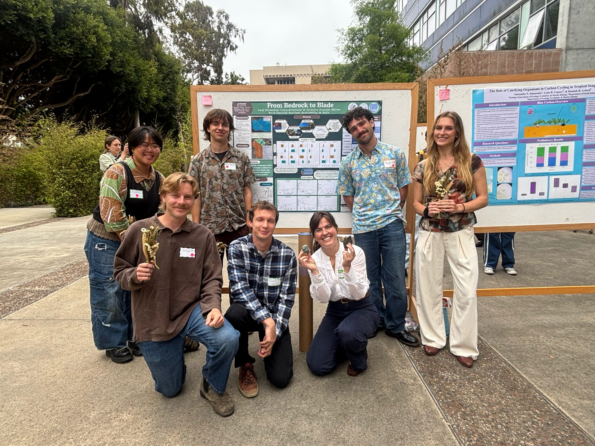
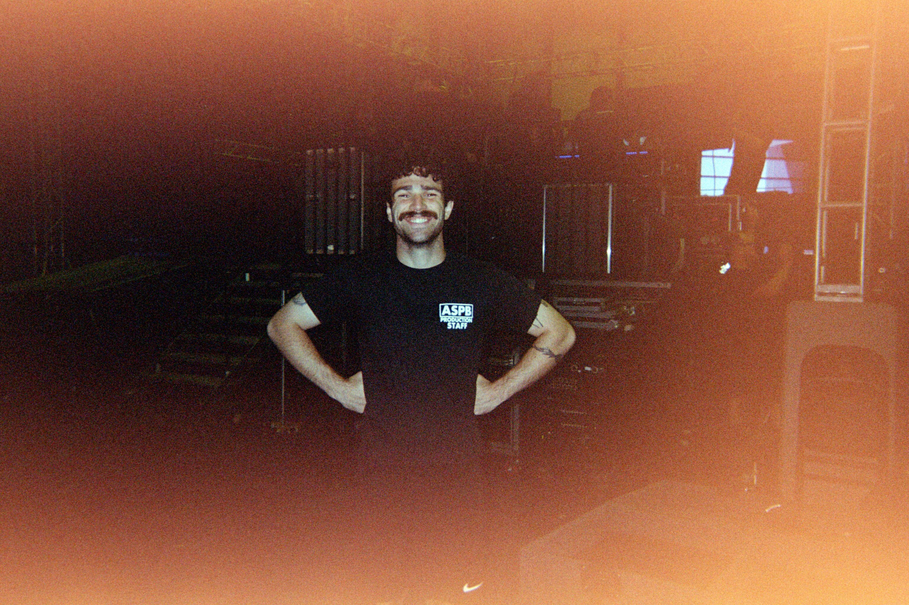
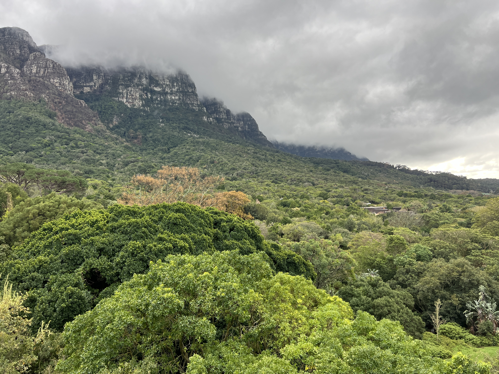
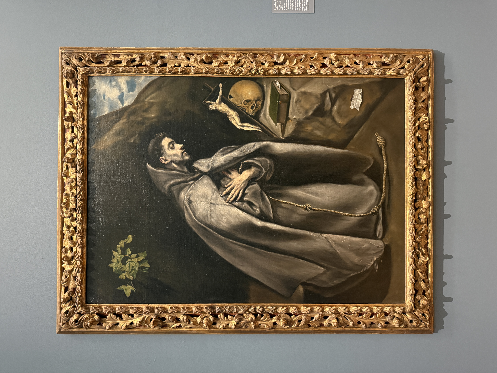

## Education and Background

::: {layout="[60,40]" layout-valign="top"}
I am currently an undergraduate at UCSB where I am pursuing two degrees. The first of which is a BS in Hydrologic Sciences and Policy and the second of which is a BA in English. I am hoping to complete my undergraduate time here at UCSB in the spring of 2028.
:::

::: {layout="[40,60]" layout-valign="top"}
{fig-align="left"}

I have a deep interest in both my fields of study and their intersection. My time studying hydrology has been focused on the relation of soil lithology to water and nutrient uptake in invasive grasses. Though I also have a deep interest in the interface between California soils and native oak trees, in regards to both hydrology and nutrient uptake. Outside of this, I hope to explore further how older written accounts, especially those by the native peoples of these lands, can help us understand the modern issues we are facing throughout the ecosystems of California.
:::

::: {layout="[40,60]" layout-valign="top"}
{fig-align="right"}

My interest in English stems almost entirely from my mother. Who, during my childhood, was an English teacher and is avid book lover. That love has been passed down to me and has caused me to become a voracious reader of all genres. My work and writing here at UCSB has mainly dealt with how we, as English speakers and writers, ascribe animacy to the nature world and how the outside environment conditions what we write. 
:::

## Work and Research

I have been incredibly lucky that during my time so far at UCSB I have had the opportunity to be involved in both research and outside work. Both of which I am deeply passionate about.

### Research

::: {layout="[40,60]" layout-valign="top"}
{fig-align="left"}

I got involved in research at UCSB working with Piper Lovegreen collecting soil samples at Sedgwick reserve, with an amazing resarch group dubbed the "Dirt Divas." Begininng in the spring of 2026 I started working as an undergraduate researcher in the LEAF lab where I have been able to continue my favorite part of research, fieldwork, alongside developing my hands on skills in the lab. Fieldwork is by far my favorite part of research and I am excited to keep gaining experience doing just that.
:::

### Work

Since my first year at UCSB I have worked for AS Program Board Production helping make events all around campus happen. In y role now I act as lead production coordinator where I, among many other things, fully plan the production for events ranging from intimate concerts to 17,000 capacity festivals, manage a team of twenty student staff, act as lead systems and audio tech, and work as lead audio engineer. As a concert and music lover this is some of my dream work and I hope to continue doing throughout my time at UCSB.

::: {layout-ncol=1 layout-valign="center"}
{width="40%" fig-align="center"}
:::

## Inspirations and Hobbies

::: {layout="[60,40]" layout-valign="top"}
Most of my inspiration in life comes from the outdoors. Since I was little I have spent a copious amount of time outdoors exploring, hiking, and rock climbing. My love for the outdoors has manifested itself in a love for travel. Travelling, to me, has presented me with the opportunity to not only see so many new environments but also absorb new perspectives on life and the human condition. 

Outside of all of this, I am a huge media lover. This passion has led to find inspirations in a whole host of different sources and forms. Of course, reading and music are the main sources of which (below I have listed some of my inspirations) but I also am an avid lover of museums and art. 

{fig-align="right"}
:::

Some authors, artists, and musicians that have inspired me and my writing are:

::: {layout="[65,35]" layout-valign="top"}
::: {}
- Ursula K. Le Guin (especially the *Hainish Cycle*)
- Robert Frost and Wallace Stevens
- Claude Monet
- Octavia Butler (of which I recommend *Earthseed* and *Xenogenesis*)
- Adrianne Lenker
- John Williams (the author)
- Jeff Tweedy (in all regards)
- Harold Sohlberg
- Jerry Garcia
- Georges Seurat
:::

{fig-align="right" width="100%"}
:::